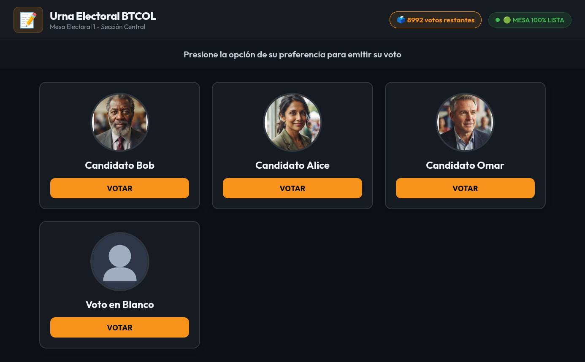
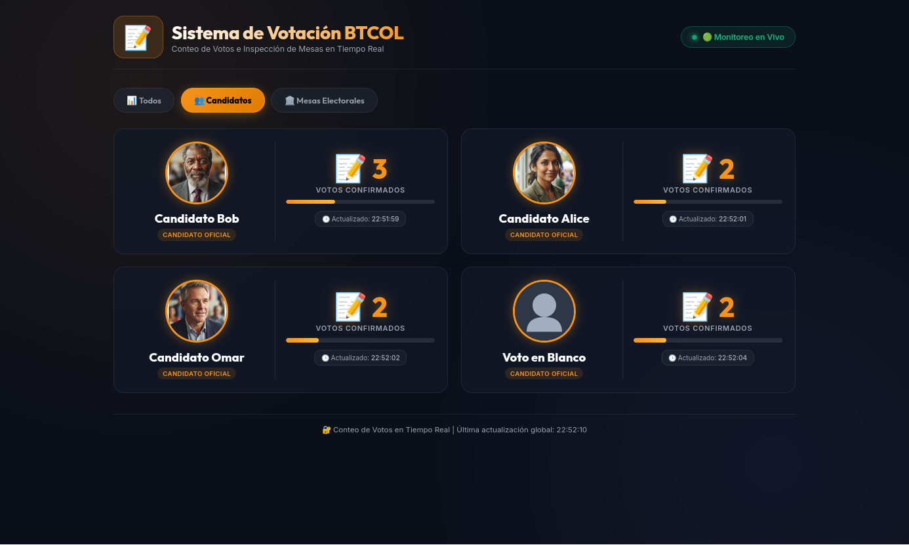
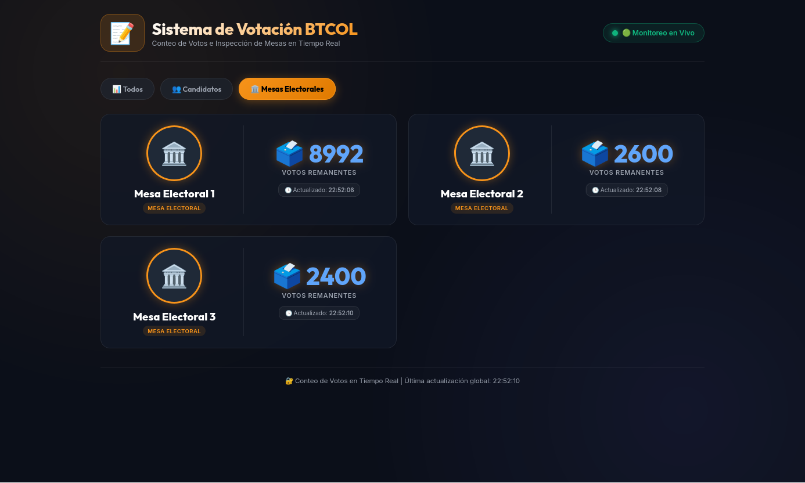
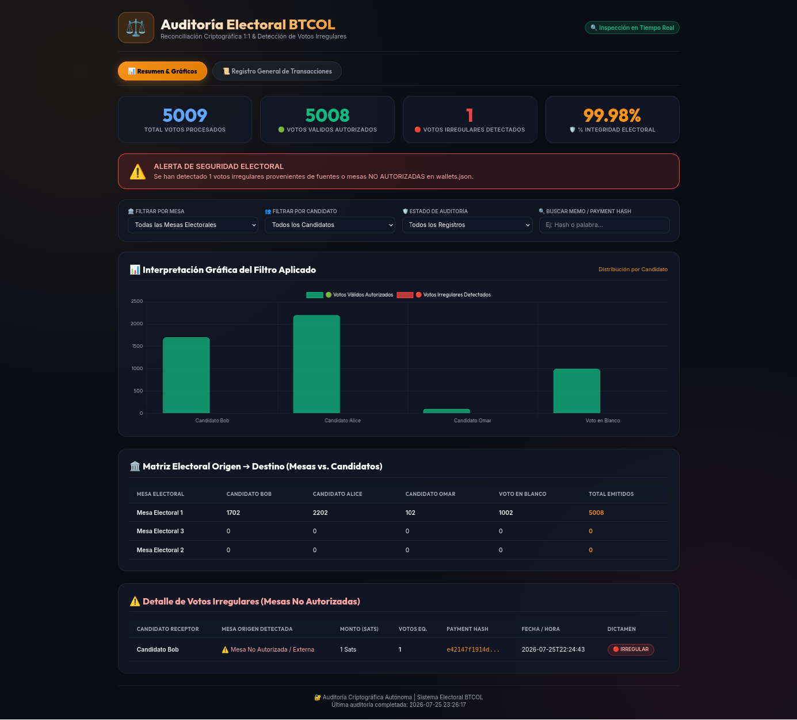

# 📝 Sistema de Votación BTCOL (LNbits + Tor) 🚀

Sistema integral, transparente, auditable y de alta disponibilidad para **votaciones electrónicas democráticas** basado en la red **Bitcoin Lightning Network**, **LNbits** y enrutamiento anónimo **Tor (.onion)**.

El sistema permite realizar elecciones electrónicas en las cuales cada voto se emite mediante una transacción Lightning Network desde la wallet de una **Mesa Electoral** hacia la wallet del **Candidato** seleccionado, registrando un memo criptográfico inalterable. 

Incluye una **Urna Electoral BTCOL**, un **Dashboard de Monitoreo BTCOL en Tiempo Real** y un **Dashboard Web Interactivo de Auditoría Electoral BTCOL** con detección de irregularidades.

---

## 📸 Capturas de Pantalla de la Plataforma

> [!NOTE]
> *Reemplaza las rutas de las imágenes en `docs/assets/` con las capturas de pantalla de tu despliegue real.*

### 1. Urna Electoral BTCOL (Puerto 2007)


### 2. Dashboards Web de Monitoreo en Tiempo Real (Puerto 5050)

**Vista Principal: Escrutinio de Candidatos**


**Vista Secundaria: Estatus y Saldo de Mesas Electorales**


### 3. Dashboard Interactivo de Auditoría Electoral BTCOL (Puerto 7070)


---

## 🎯 Funcionalidades y Capacidades Avanzadas

### 🧅 1. Conectividad Nativa Cifrada vía Red Anónima Tor (.onion)
- Todas las peticiones HTTP a la API de LNbits se enrutan de forma cifrada a través del proxy **Tor SOCKS5h (`socks5h://127.0.0.1:9050`)**.
- Garantiza la privacidad y el anonimato de las comunicaciones entre las Mesas Electorales, los Dashboards y el nodo Lightning.
- Incorpora mecanismos de **reintento automático y timeout extendido (25s)** ante fluctuaciones o reconstrucción de circuitos `.onion`.

### 🛡️ 2. Límite de Capacidad Dinámico e Inmanipulable por Saldo Real
- La capacidad autorizada de votos de cada Mesa Electoral **se calcula matemáticamente en tiempo real** en función del saldo en satoshis de su wallet de LNbits:
  $$\text{Votos Disponibles} = \left\lfloor \frac{\text{Saldo Actual de Wallet Mesa (Sats)}}{\text{Monto por Voto (ej: 100 Sats)}} \right\rfloor$$
- **Imposible de manipular localmente**: No existen valores enteros estáticos en archivos de configuración locales.
- **Bloqueo en Backend**: Si la wallet se queda sin saldo (`votos_disponibles < 1`), la Urna Electoral rechaza la solicitud de voto con HTTP 403 antes de registrarla en la base de datos local SQLite.
- **Indicador en Vivo & Banner de Cierre**: La interfaz de la mesa muestra un badge en vivo con los votos restantes y cierra automáticamente la pantalla táctil cuando la capacidad se agota.

### 👥 3. Rediseño del Dashboard Principal (`frontend/votos_dashboard.py` - Puerto 5050)
- **Tarjetas Divididas en 2 Columnas**:
  - **Mitad Izquierda**: Fotografía oficial del candidato ampliada a 120px con borde de resplandor dorado Bitcoin (`#F7931A`) y nombre del participante centrado debajo de la foto.
  - **Mitad Derecha**: Conteo de votos confirmados en tipografía `Outfit`, barra de progreso con el porcentaje relativo acumulado y marca de hora de actualización (`🕒 Actualizado: HH:MM:SS`).
- **Resiliencia de Conteos**: Implementación de una cache de último estado conocido (`last_known_status`) para mantener fijos y estables los votos de los candidatos ante pequeñas fluctuaciones de la red Tor, evitando parpadeos a 0 votos.

### ⚖️ 4. Dashboard Web Interactivo de Auditoría (`audit/auditoria_ln_votos.py` - Puerto 7070)
- **Navegación por Pestañas**:
  - **`📊 Resumen & Gráficos`**: Vista ejecutiva con tarjetas KPI, alerta de seguridad, matriz Origen ➔ Destino y gráfico interactivo de barras.
  - **`📜 Registro General de Transacciones`**: Listado exhaustivo de todas las transacciones auditadas.
- **Gráfico de Barras Dinámico con Chart.js**: Gráfico interactivo que se actualiza en tiempo real al aplicar filtros por Mesa, Candidato, Estado o Búsqueda.
- **🚨 Detección Criptográfica de Votos Irregulares**: Identifica y aísla automáticamente cualquier voto o transacción acreditada a un candidato que provenga de una `wallet_id` o fuente externa **no registrada en `data/wallets.json`**.
- **Matriz Electoral Origen ➔ Destino**: Tabla cruzada que demuestra de forma transparente cuántos votos envió cada Mesa Electoral a cada Candidato.

### 🚀 5. Arquitectura 100% Escalable e Impulsada por Datos (Data-Driven)
- El sistema escala de forma totalmente dinámica: para agregar 5, 10 o 100 nuevas Mesas o Candidatos, **únicamente debes agregarlos a `data/wallets.json` o `candidatos.json`**.
- Ningún módulo (Urna Web, Dashboard de Votos ni Auditoría) requiere modificar una sola línea de código Python, JavaScript o HTML.

---

## 🔒 Archivos Sensibles a Proteger (No Subir al Repositorio)

Por motivos de seguridad criptográfica, las claves privadas y las bases de datos locales **NUNCA deben subirse a repositorios públicos de Git**. El archivo `.gitignore` protege automáticamente:

| Archivo / Directorio | Descripción / Razón de Protección |
|----------------------|-----------------------------------|
| `data/wallets.json` | Contiene las **Invoice Keys** e IDs reales de todas las wallets de candidatos y mesas. |
| `mesa_code/data_mesa/mesa_config.json` | Contiene la **Admin Key** de la wallet de la Mesa Electoral (permiso de pago). |
| `mesa_code/data_mesa/candidatos.json` | Contiene las Invoice Keys reales de las wallets de candidatos. |
| `.env`, `*.env` | Variables de entorno privadas. |
| `data/database.sqlite3` | Base de datos SQLite interna de la instancia LNbits. |
| `mesa_code/data_mesa/votos_local.db` | Base de datos SQLite local de la Mesa Electoral. |
| `logs/`, `*.log` | Archivos de registros del sistema. |

> [!CAUTION]
> Asegúrate de utilizar únicamente archivos de plantilla como `wallets.example.json` para publicar en repositorios de Git.

---

## 🏗️ Arquitectura General del Sistema

```
                                  ┌──────────────────────────────────────────┐
                                  │    Urna Electoral Web (Puerto 2007)      │
                                  │      [mesa_code/app_web_mesa.py]         │
                                  └────────────────────┬─────────────────────┘
                                                       │ 
                                                       │ Transacción Lightning por Tor (Sats + Memo Cifrado)
                                                       ▼
┌──────────────────────────────────────────┐       ┌──────────────────────────────────────────┐
│   Dashboard Interactivo de Auditoría    │◄──────┤        Nodo LNbits (Red Tor .onion)      │
│   (Puerto 7070)                          │       └────────────────────┬─────────────────────┘
│   [audit/auditoria_ln_votos.py]          │                            │
└──────────────────────────────────────────┘                            │ Monitoreo Read-Only (Invoice Keys)
                                                                        ▼
                                                  ┌──────────────────────────────────────────┐
                                                  │       Dashboard Web (Puerto 5050)        │
                                                  │      [frontend/votos_dashboard.py]       │
                                                  └──────────────────────────────────────────┘
```

---

## 🚀 Guía de Inicio Rápido e Implementación

### 1. Requisitos Previos
- Python 3.8+
- Servicio proxy Tor activo en local (`127.0.0.1:9050`) si utilizas nodos LNbits `.onion`.
- Instancia LNbits accesible.

### 2. Instalación
```bash
git clone <URL_DEL_REPOSITORIO>
cd sistema-votacion-btcol
bash setup.sh
```

### 3. Configuración de Credenciales LNbits

#### A. Configurar Wallets Globales (`data/wallets.json`)
Copia la plantilla `wallets.example.json` a `data/wallets.json` e ingresa las **Invoice Keys** (solo lectura) de tus wallets:
```bash
cp wallets.example.json data/wallets.json
nano data/wallets.json
```

#### B. Configurar la Urna de Mesa (`mesa_code/data_mesa/mesa_config.json`)
Configura la **Admin Key** de la wallet asignada a la mesa (necesaria para que la mesa realice los pagos de los votos):
```bash
nano mesa_code/data_mesa/mesa_config.json
```

---

### 4. Ejecución de Componentes

#### 🖥️ A. Urna Electoral Web de Mesa (Puerto 2007)
```bash
python mesa_code/app_web_mesa.py
```
*Acceso en navegador:* `http://localhost:2007`

#### 🌐 B. Dashboard Web de Monitoreo en Tiempo Real (Puerto 5050)
```bash
python frontend/votos_dashboard.py
```
*Acceso en navegador:* `http://localhost:5050`

#### ⚖️ C. Dashboard Interactivo de Auditoría Electoral (Puerto 7070)
```bash
python audit/auditoria_ln_votos.py
```
*Acceso en navegador:* `http://localhost:7070`

#### 🔓 D. Desencriptación en Lote de Cédulas Capturadas
Si has capturado fotos de cédulas durante la votación web, puedes desencriptar todas las fotos del lote de forma automática sin ingresar contraseñas, ya que el sistema utiliza automáticamente el hash de cada factura como su clave.
```bash
./desencriptador/desencriptar_lote.sh
```
Las imágenes desencriptadas se almacenarán en `desencriptador/cedulas_desencriptadas/`.

---

### 5. ¿Cómo usar la captura de cédulas web?
1. Abre la Urna Electoral Web (`http://localhost:2007`).
2. Haz clic sobre la tarjeta de un candidato.
3. Se abrirá la cámara del navegador. Centra el documento de identidad en el recuadro amarillo.
4. Presiona la **Barra Espaciadora** o haz clic en el botón de la cámara para tomar la foto.
5. Confirma el voto. El sistema cifrará automáticamente la imagen, guardará el archivo `.enc` usando el Hash LNbits de la transacción como nombre y te mostrará un ticket de comprobante rediseñado con código QR.
6. Todos los archivos cifrados quedan guardados de forma segura en `mesa_code/impresora/capturas_cedula/`.

---

## 📄 Licencia

Software libre y de código abierto. Desarrollado para la comunidad de **Bitcoin Lightning Network**.
